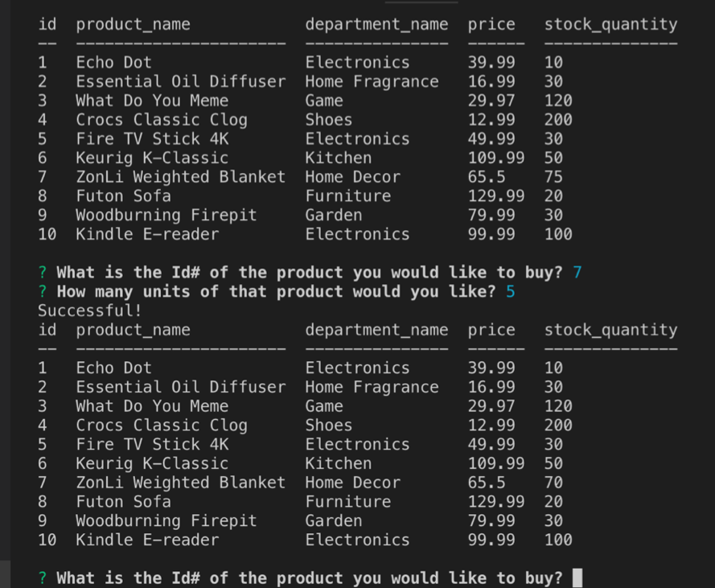

# Node.js-MySQL

Bamazon is a storefront app that takes orders from customers and depletes stock from the store's inventory.

The database contains 10 different products. The customer is presented with a table of these products along with: Item ID, Department Name, Price and Stock Quantity.

The app will prompt the user to type the Item ID of the product they would like to buy. Then they will be asked, how many units of that product they would like. 

If the user wants more than the stock quantity available they will receive an “Insufficient quantity, Please try again!” message. The app will print the product table again.

Now if the user selects an item with an available quantity, they will receive a “Successful!” message. The app will then subtract the amount they purchased and print a new table showing the customer the new available stock quantity.

Customers can purchase as many products as they would like. 

Bamazon uses Inquirer npm package as well as MySQL database, which is used for data input and storage.